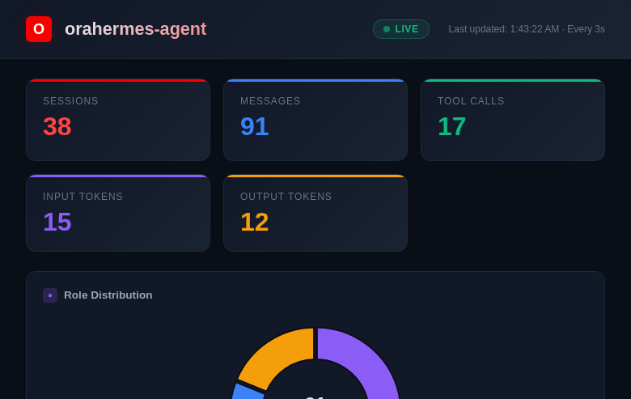
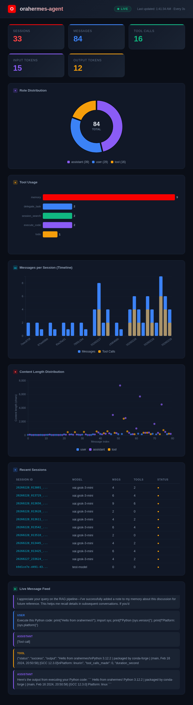

<p align="center">
  
</p>

# orahermes-agent

**Persistent AI Agent powered by Oracle AI Database, Vector Search & OCI GenAI**

<p align="center">
  <a href="https://www.oracle.com/database/free/"></a>&nbsp;
  <a href="https://docs.oracle.com/en-us/iaas/Content/generative-ai/home.htm"></a>&nbsp;
  <a href="https://docs.oracle.com/en/database/oracle/oracle-database/23/vecse/"></a>&nbsp;
  <a href="https://docs.oracle.com/en-us/iaas/Content/search-opensearch/home.htm"></a>&nbsp;
  <a href="https://x.ai/"></a>&nbsp;
  <a href="https://ollama.com/"></a>&nbsp;
  <a href="https://docs.oracle.com/en-us/iaas/Content/generative-ai/home.htm"></a>&nbsp;
  <a href="https://www.python.org/"></a>&nbsp;
  <a href="https://github.com/NousResearch/hermes-agent/blob/main/LICENSE"></a>
</p>

---

<div align="center">

**[View Interactive Presentation](docs/slides/presentation.html)** | Animated overview of the project

</div>

<table>
<tr>
<td></td>
<td></td>
</tr>
<tr>
<td></td>
<td></td>
</tr>
<tr>
<td></td>
<td></td>
</tr>
</table>

---

A fork of [NousResearch/hermes-agent](https://github.com/NousResearch/hermes-agent) that replaces the default inference and storage layers with Oracle Cloud Infrastructure services, and adds **semantic long-term memory** via Oracle AI Vector Search:

- **OCI GenAI** (xAI Grok models) or **Ollama** (local inference) instead of OpenRouter
- **Oracle 26ai Free** instead of SQLite for session and message storage
- **Oracle AI Vector Search** -- every message is embedded in-database using an ONNX model, enabling meaning-based recall across all past conversations

---

## Table of Contents

- [Quick Start](#quick-start)
- [Architecture](#architecture)
- [Features](#features)
  - [Semantic Memory (Oracle AI Vector Search)](#semantic-memory-oracle-ai-vector-search)
  - [Three-Provider LLM Architecture](#three-provider-llm-architecture)
  - [30+ Built-in Tools](#30-built-in-tools)
  - [Skills System](#skills-system)
  - [Messaging Gateways](#messaging-gateways)
  - [Persistent Memory](#persistent-memory)
  - [Context Compression](#context-compression)
  - [Subagent Delegation](#subagent-delegation)
  - [Cron Scheduler](#cron-scheduler)
  - [Training Data Export](#training-data-export)
  - [Live Dashboard](#live-dashboard)
- [What's Different from Upstream](#whats-different-from-upstream)
- [Configuration Reference](#configuration-reference)
- [Testing](#testing)
- [License](#license)

---

## Quick Start

<!-- one-command-install -->
> **One-command install** — clone, configure, and run in a single step:
>
> ```bash
> curl -fsSL https://raw.githubusercontent.com/jasperan/orahermes-agent/main/install.sh | bash
> ```
>
> <details><summary>Advanced options</summary>
>
> Override install location:
> ```bash
> PROJECT_DIR=/opt/myapp curl -fsSL https://raw.githubusercontent.com/jasperan/orahermes-agent/main/install.sh | bash
> ```
>
> Or install manually:
> ```bash
> git clone https://github.com/jasperan/orahermes-agent.git
> cd orahermes-agent
> # See below for setup instructions
> ```
> </details>


### Prerequisites

| Requirement | Details |
|---|---|
| **Python** | 3.11 or newer |
| **Oracle 26ai Free** | Running container (see [Database Setup](#database-setup) below) |
| **LLM Provider** | Ollama (local, default) or OCI GenAI (cloud) |

### Installation

```bash
# Clone
git clone https://github.com/jasperan/orahermes-agent.git
cd orahermes-agent

# Run the setup script (installs uv, creates venv, installs deps)
./setup-hermes.sh

# Or install manually
pip install -e ".[all]"
```

### Database Setup

Start Oracle 26ai Free as a container:

```bash
docker run -d \
  --name oracle-26ai \
  -p 1521:1521 \
  -e ORACLE_PWD=YourPassword123 \
  container-registry.oracle.com/database/free:latest-lite
```

Wait for the database to be ready, then create the Hermes schema:

```bash
# Connect as SYSDBA and create the hermes user
sqlplus sys/YourPassword123@localhost:1521/FREEPDB1 as sysdba <<'SQL'
CREATE USER hermes IDENTIFIED BY HermesPass123
  DEFAULT TABLESPACE users QUOTA UNLIMITED ON users;
GRANT CONNECT, RESOURCE, CTX_APP, DB_DEVELOPER_ROLE TO hermes;
SQL

# Apply the base schema (sessions + messages + Oracle Text index)
sqlplus hermes/HermesPass123@localhost:1521/FREEPDB1 @oracle_setup.sql

# Apply the vector search migration (embedding column + HNSW index)
sqlplus hermes/HermesPass123@localhost:1521/FREEPDB1 @oracle_setup_vector.sql
```

Add the connection details to `.env`:

```bash
ORACLE_DSN=localhost:1521/FREEPDB1
ORACLE_USER=hermes
ORACLE_PASSWORD=HermesPass123
```

### LLM Provider Setup

**Option A: Ollama (local, default)**

```bash
# Install Ollama and pull a model
ollama pull qwen3.5:4b

# That's it -- Ollama is the default provider, no extra config needed
```

**Option B: OCI GenAI (cloud)**

Configure your `~/.oci/config` profile and set in `.env`:

```bash
OCI_PROFILE=DEFAULT
OCI_REGION=us-chicago-1
OCI_COMPARTMENT_ID=ocid1.compartment.oc1..your-compartment-ocid
LLM_MODEL=xai.grok-3-mini
```

Then run the setup wizard to select OCI as your provider:

```bash
orahermes setup
```

### Run

```bash
# Interactive CLI
orahermes

# Single query
orahermes chat -q "What's the status of our deployment?"

# Diagnostics
orahermes doctor

# Configuration wizard
orahermes setup

# List available tools
orahermes --list-tools
```

---

## Architecture

```
+-----------------------+       +---------------------+       +---------------------------+
|                       |       |                     |       |                           |
|  Ollama / OCI GenAI   | <---> |   orahermes-agent   | <---> |    Oracle 26ai Free       |
|  / Custom endpoint    |       |                     |       |       (FREEPDB1)          |
|                       |       |                     |       |                           |
+-----------------------+       +---------------------+       +---------------------------+
  Three-provider LLM              Tool-calling engine           Session & message storage
  Ollama (default)                 30+ built-in tools            Oracle Text full-text search
  OCI GenAI (xAI Grok)            Skills & scheduling            Oracle AI Vector Search
  Any OpenAI-compatible            Messaging gateways            In-DB ONNX embeddings (384d)
                                   Memory & compression          HNSW vector index
```

### Core Agent Loop

```
User input
  -> AIAgent.chat() [run_agent.py]
    -> Build system prompt (memory, skills, context files)
    -> LLM API call (Ollama / OCI GenAI / custom)
      -> Tool calls detected?
        -> Yes: registry.dispatch() -> execute tool -> embed result -> loop back
        -> No: return text response
      -> Persist message + vector embedding to Oracle DB
```

### Session Backend (Dependency Injection)

`hermes_state.get_session_db()` returns `OracleSessionDB` if `ORACLE_DSN` is set, otherwise falls back to `SessionDB` (SQLite). Both implement identical method signatures, so every component works transparently with either backend. Vector search methods (`semantic_search`, `hybrid_search`, `embed_message`) are only available on `OracleSessionDB`.

---

## Features

### Semantic Memory (Oracle AI Vector Search)

The headline feature unique to this fork. Every message exchanged with the agent is automatically embedded as a 384-dimensional vector using an in-database ONNX model (`ALL_MINILM_L6_V2`), stored in a `VECTOR(384, FLOAT32)` column, and indexed with an HNSW vector index for fast approximate nearest-neighbor search.

This gives the agent **semantic long-term memory** -- it can recall past conversations by *meaning*, not just keywords.

**How it works:**

1. **Auto-embed on insert**: After every `append_message()`, a background thread calls `VECTOR_EMBEDDING()` in Oracle to generate and store the embedding. Zero Python-side overhead -- the ONNX model runs inside the database.
2. **Three search modes** via the `semantic_recall` tool:
   - **`hybrid`** (default): Combines Oracle Text keyword search with vector cosine similarity, weighted 40/60, and re-ranks results. Best overall accuracy.
   - **`vector`**: Pure semantic similarity. Finds conceptually related conversations even with completely different wording.
   - **`keyword`**: Traditional Oracle Text `CONTAINS` search. Exact term matching.
3. **Backfill**: `db.backfill_embeddings()` processes existing messages that don't have embeddings yet, useful when enabling vector search on an existing database.
4. **Graceful degradation**: If the vector migration hasn't been applied or the ONNX model isn't loaded, the tool automatically falls back to keyword search. The agent works fine without vector support -- it's purely additive.

**Example agent usage:**

```
User: "Remember that time we debugged the deployment issue?"
Agent: [calls semantic_recall with query="debugging deployment problems"]
       -> Finds sessions about "rollout failures", "CI/CD pipeline errors",
         "nginx config issues" -- even though none used the word "deployment"
```

**Schema additions** (`oracle_setup_vector.sql`):

```sql
ALTER TABLE messages ADD (embedding VECTOR(384, FLOAT32));
CREATE VECTOR INDEX idx_messages_embedding ON messages(embedding)
    ORGANIZATION NEIGHBOR PARTITIONS DISTANCE COSINE WITH TARGET ACCURACY 95;
```

### Three-Provider LLM Architecture

The agent supports three LLM backends, selectable via the setup wizard or environment variables:

| Provider | Backend | Default Model | Use Case |
|----------|---------|---------------|----------|
| **`ollama`** (default) | Local Ollama instance | `qwen3.5:4b` | Offline, privacy, no API costs |
| **`oci`** | OCI GenAI | `xai.grok-3-mini` | Cloud inference, enterprise |
| **`custom`** | Any OpenAI-compatible endpoint | User-specified | vLLM, Together, Groq, etc. |

**Available models:**

- **Ollama**: Qwen3.5 family (0.8b through 35B-A3B MoE), plus any model Ollama supports
- **OCI GenAI**: xAI Grok-3, Grok-3-mini, Meta Llama 3.3 70B, Llama 4 Maverick
- **Custom**: Any model at any OpenAI-compatible endpoint

Provider is configured in `~/.hermes/config.yaml` and can be overridden per-session with `HERMES_PROVIDER=oci`.

### 30+ Built-in Tools

Every tool self-registers via `tools/registry.py` at import time. The agent receives tool schemas in OpenAI function-calling format and can chain multiple tool calls per turn.

| Category | Tools | Description |
|----------|-------|-------------|
| **Web** | `web_search`, `web_extract` | Search the web (SearXNG/DuckDuckGo), extract/scrape page content (Firecrawl) |
| **Terminal** | `terminal`, `process` | Execute shell commands with multiple backends (local, SSH, Docker, Singularity, Modal), manage long-running processes |
| **File Operations** | `read_file`, `write_file`, `patch`, `search_files` | Read, write, fuzzy-match patch, and search across files with content/path matching |
| **Browser** | `browser_navigate`, `browser_click`, `browser_type`, `browser_scroll`, `browser_snapshot`, `browser_vision`, + 4 more | Full browser automation via Browserbase -- navigate, interact, screenshot, PDF export |
| **Vision** | `vision_analyze` | Analyze images using vision models (Nous API) |
| **Image Generation** | `image_generate` | Text-to-image via FAL.ai (Flux 2) |
| **Text-to-Speech** | `text_to_speech` | Convert text to audio with Edge TTS (free), ElevenLabs, or OpenAI |
| **Planning** | `todo` | Task management for multi-step agent work -- create, update, and track task lists |
| **Memory** | `memory` | Persistent curated notes and user profile that survive across sessions. Injected into the system prompt |
| **Session Search** | `session_search` | Keyword-based search across all past sessions with LLM-powered summarization of matching conversations |
| **Semantic Recall** | `semantic_recall` | Vector similarity search over past conversations using Oracle AI Vector Search. Finds semantically related content by meaning |
| **Skills** | `skills_list`, `skill_view`, `skill_manage` | Create, view, edit, and manage reusable skill documents (procedures, templates, checklists) |
| **Reasoning** | `mixture_of_agents` | Multi-model collaboration -- query multiple LLMs and synthesize their responses |
| **Code Execution** | `execute_code` | Run Python scripts in a sandboxed RPC environment with access to agent tools |
| **Delegation** | `delegate_task` | Spawn child agents with isolated context for parallel subtask execution |
| **Scheduling** | `schedule_cronjob`, `list_cronjobs`, `remove_cronjob` | Schedule, list, and remove recurring automated tasks |
| **Messaging** | `send_message` | Send messages across platforms (Telegram, Discord, WhatsApp, Slack) from within the agent |
| **Clarification** | `clarify` | Ask the user multiple-choice or open-ended clarifying questions |
| **RL Training** | 10 tools | Manage reinforcement learning environments and training runs (Atropos/Tinker) |

### Skills System

The agent can learn, store, and reuse multi-step procedures as **skills** -- markdown documents with YAML frontmatter stored in `~/.hermes/skills/`.

- **Self-describing**: Each skill has name, description, tags, and related skills
- **Versioned**: Tracks updates with auto-reload on change
- **Composable**: Skills can reference and call other skills
- **Access-controlled**: Agent requests user approval before executing sensitive skills

A Skills Hub design is in progress (`docs/skills_hub_design.md`) for discovering and sharing skills across the community, with security scanning for malicious content.

### Messaging Gateways

The agent runs as a bot on four messaging platforms simultaneously via `gateway/run.py`:

| Platform | Features |
|----------|----------|
| **Telegram** | Full tool access, inline keyboards, file/image sharing, per-chat sessions |
| **Discord** | Server + DM support, message threading, file uploads, reaction handling |
| **WhatsApp** | WhatsApp Business API integration, media support, per-chat sessions |
| **Slack** | Workspace bot, threaded conversations, Slack Block Kit formatting |

Each adapter maintains per-chat session state via `OracleSessionDB`, enabling conversation continuity. Install as a systemd service:

```bash
./scripts/hermes-gateway install
./scripts/hermes-gateway start
```

### Persistent Memory

Two bounded, file-backed memory stores injected into the system prompt at session start:

- **`MEMORY.md`**: Agent's personal notes -- environment facts, project conventions, tool quirks, lessons learned
- **`USER.md`**: What the agent knows about the user -- name, role, preferences, communication style

Memory is captured as a frozen snapshot at session start (preserving prefix cache stability) while writes take effect immediately on disk for the next session. Content is scanned for prompt injection and exfiltration patterns before acceptance.

### Context Compression

When the conversation token count approaches the model's context limit, the agent automatically:

1. Summarizes older messages into a compressed history
2. Uses an auxiliary LLM (Llama 3.3 70B on OCI or Qwen on Ollama) for summarization
3. Replaces old messages with the summary, freeing context window for new turns
4. Maintains conversation continuity through the compression boundary

### Subagent Delegation

The `delegate_task` tool spawns child agents with isolated context for parallel subtask execution. Child sessions are linked via `parent_session_id` in Oracle DB, enabling full conversation tree tracing. The parent agent receives a summary of each child's work.

### Cron Scheduler

Schedule recurring tasks that the agent executes on a cron schedule. Jobs persist across agent restarts and are managed through the `schedule_cronjob`, `list_cronjobs`, and `remove_cronjob` tools.

### Training Data Export

Conversations are exportable in **ShareGPT format** for fine-tuning:

```json
{
  "conversations": [
    {"from": "system", "value": "..."},
    {"from": "human", "value": "..."},
    {"from": "gpt", "value": "<tool_call>\n{...}\n</tool_call>..."}
  ],
  "tools": "[...]",
  "source": "hermes-agent"
}
```

Supports `<tool_call>`, `<tool_response>`, and `<think>` XML tags for training tool-calling and reasoning models. RL training environments (Atropos) are also included for reinforcement learning from human feedback.

### Live Dashboard

A real-time D3.js dashboard visualizes all data orahermes-agent produces in Oracle Database -- sessions, messages, tool usage, token counts, and content lengths. Auto-refreshes every 3 seconds.

```bash
ORACLE_DSN=localhost:1521/FREEPDB1 ORACLE_USER=hermes ORACLE_PASSWORD=<password> \
    python dashboard_server.py --port 8501
```

<p align="center">
  
</p>

<p align="center">
  
</p>

**Charts included:**
- KPI cards (sessions, messages, tool calls, estimated tokens) with animated counters and delta indicators
- Role distribution donut chart (user / assistant / tool)
- Tool usage horizontal bar chart
- Token usage by role donut chart
- Tokens per session stacked bar chart (input vs output)
- Messages per session timeline with tool call overlay
- Content length scatter plot colored by role
- Recent sessions table with model, message count, and status
- Live message feed with role-colored entries

---

## What's Different from Upstream

This fork makes **three additions** on top of the upstream hermes-agent codebase:

### 1. OpenRouter --> OCI GenAI + Ollama

| | Upstream | orahermes-agent |
|---|---|---|
| **Provider** | OpenRouter | Ollama (default) / OCI GenAI / Custom |
| **Auth** | API key (`OPENROUTER_API_KEY`) | None (Ollama) or OCI config profile |
| **Default model** | `anthropic/claude-opus-4.6` | `qwen3.5:4b` (Ollama) or `xai.grok-3-mini` (OCI) |
| **SDK** | `openai` | `openai` (Ollama), `oci-openai` (OCI) |

New files: `oci_client.py`, `agent/auxiliary_client.py` (multi-provider), `agent/model_metadata.py` (local catalogue).

### 2. SQLite --> Oracle 26ai Free

| | Upstream | orahermes-agent |
|---|---|---|
| **Database** | SQLite (local file) | Oracle 26ai Free (container) |
| **Driver** | `sqlite3` (stdlib) | `oracledb` (python-oracledb) |
| **Connection** | File path | Connection pool (`oracledb.create_pool`) |
| **Full-text search** | FTS5 | Oracle Text (`CTXSYS.CONTEXT`) |

New files: `oracle_state.py` (drop-in `OracleSessionDB`), `oracle_setup.sql` (DDL).

### 3. Oracle AI Vector Search (Semantic Memory)

| | Upstream | orahermes-agent |
|---|---|---|
| **Long-term recall** | Keyword search only | Keyword + vector similarity + hybrid |
| **Embeddings** | None | In-DB ONNX model (`ALL_MINILM_L6_V2`, 384d) |
| **Vector index** | None | HNSW with cosine distance, 95% target accuracy |
| **Search tool** | `session_search` (FTS5) | `session_search` (keywords) + `semantic_recall` (vector/hybrid) |

New files: `oracle_setup_vector.sql` (migration), `tools/semantic_recall_tool.py`. Extended: `oracle_state.py` (vector methods), `run_agent.py` (auto-embed on insert).

---

## Configuration Reference

### Environment Variables (`.env`)

```bash
# Oracle Database
ORACLE_DSN=localhost:1521/FREEPDB1
ORACLE_USER=hermes
ORACLE_PASSWORD=<password>

# LLM Provider (pick one)
HERMES_PROVIDER=ollama              # or: oci, custom
OLLAMA_BASE_URL=http://localhost:11434/v1

# OCI GenAI (if using oci provider)
OCI_PROFILE=DEFAULT
OCI_REGION=us-chicago-1
OCI_COMPARTMENT_ID=<compartment-ocid>
LLM_MODEL=xai.grok-3-mini

# Custom endpoint (if using custom provider)
OPENAI_API_KEY=<key>
OPENAI_BASE_URL=<url>

# Tool API Keys (optional -- tools degrade gracefully without them)
FIRECRAWL_API_KEY=<key>             # web_extract, web_crawl
FAL_KEY=<key>                       # image_generate
NOUS_API_KEY=<key>                  # vision_analyze
BROWSERBASE_API_KEY=<key>           # browser tools
BROWSERBASE_PROJECT_ID=<id>         # browser tools

# Messaging Gateways (optional)
TELEGRAM_BOT_TOKEN=<token>
DISCORD_BOT_TOKEN=<token>
SLACK_BOT_TOKEN=<token>
WHATSAPP_CREDENTIALS=<credentials>
```

### Config File (`~/.hermes/config.yaml`)

Generated by `orahermes setup`. Key sections:

- **`model`**: Provider, default model, base URL
- **`terminal`**: Backend (local/docker/ssh/modal/singularity)
- **`tools`**: Enabled/disabled toolsets
- **`gateway`**: Platform tokens and settings
- **`memory`**: User profile, persistent notes
- **`compression`**: Token thresholds for context compression

---

## Testing

```bash
# All unit tests (7300+ tests, no external services needed)
pytest

# Semantic recall tests specifically
pytest tests/test_semantic_recall.py -v

# Oracle integration tests (requires ORACLE_DSN)
pytest -m integration

# Oracle state tests
pytest tests/test_oracle_state.py

# Single test
pytest tests/tools/test_file_tools.py -k "test_read"
```

---

## Project Structure

```
orahermes-agent/
├── run_agent.py                 # Main agent loop (AIAgent class)
├── cli.py                       # Interactive CLI entry point
├── model_tools.py               # Tool discovery & dispatch orchestration
├── oracle_state.py              # OracleSessionDB: sessions, messages, vector search
├── oracle_setup.sql             # Base schema DDL (sessions + messages + Oracle Text)
├── oracle_setup_vector.sql      # Vector migration DDL (embedding column + HNSW index)
├── hermes_state.py              # SQLite fallback + get_session_db() factory
├── oci_client.py                # OCI GenAI client factory
├── hermes_constants.py          # Models, endpoints, defaults
├── toolsets.py                  # Toolset definitions & resolution
├── dashboard_server.py          # Live D3.js dashboard
├── agent/                       # Agent internals
│   ├── prompt_builder.py        #   System prompt assembly
│   ├── context_compressor.py    #   Automatic conversation summarization
│   ├── auxiliary_client.py      #   Multi-provider auxiliary LLM client
│   ├── model_metadata.py        #   Local model catalogue
│   ├── trajectory.py            #   ShareGPT export
│   └── prompt_caching.py        #   Anthropic prompt caching support
├── tools/                       # 30+ self-registering tool modules
│   ├── registry.py              #   Central tool registry (singleton)
│   ├── semantic_recall_tool.py  #   Vector similarity search tool
│   ├── session_search_tool.py   #   Keyword search + summarization tool
│   ├── memory_tool.py           #   Persistent memory tool
│   ├── web_tools.py             #   Web search & extraction
│   ├── terminal_tool.py         #   Shell execution
│   ├── file_tools.py            #   File operations
│   ├── browser_tool.py          #   Browser automation
│   └── ...                      #   Vision, TTS, skills, delegation, etc.
├── gateway/                     # Multi-platform messaging adapter
│   ├── run.py                   #   Gateway entry point
│   └── platforms/               #   Telegram, Discord, WhatsApp, Slack
├── hermes_cli/                  # CLI subsystem
│   ├── main.py                  #   REPL with Rich formatting
│   ├── auth.py                  #   Provider resolution
│   ├── config.py                #   Config management
│   └── setup.py                 #   Setup wizard
├── tests/                       # Unit & integration tests (7300+)
├── skills/                      # Built-in skill documents
├── cron/                        # Cron scheduler
├── environments/                # Atropos RL training environments
└── docs/                        # Architecture docs & design plans
```

---

## License

MIT -- same as upstream. See [LICENSE](LICENSE).

---

## Credit

Based on [NousResearch/hermes-agent](https://github.com/NousResearch/hermes-agent) by [Nous Research](https://nousresearch.com).

---

<div align="center">

[](https://github.com/jasperan)&nbsp;
[](https://www.linkedin.com/in/jasperan/)&nbsp;
[](https://www.oracle.com/database/free/)

</div>
